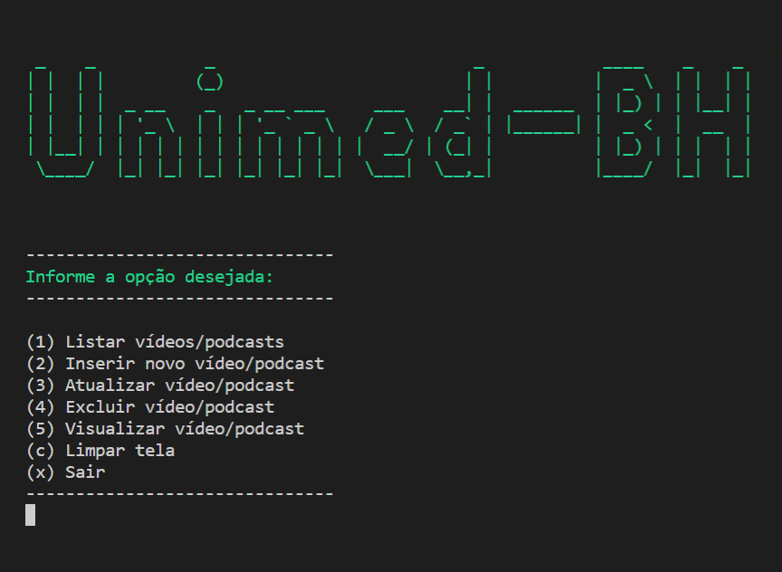

# Módulo: Dominando o Ecossistema .NET com C#  
## Desafio: Criando um APP simples de cadastro de séries em .NET  

Aprenda como criar um algoritmo simples de cadastro de séries para praticar seus conhecimentos de orientação a objetos, o principal paradigma de programação utilizada no mercado. Nesse projeto você vai aprender: Como pensar orientado a objetos, como modelar o seu domínio, como utilizar recursos de coleção para salvar seus dados em memória. 
  
Para esse desafio, eu segui as orientações do professor [Eliézer Zarpelão](https://www.linkedin.com/in/eliezerzarpelao/), em curso ministrado pela [DIO](https://www.dio.me/).  
Fiz diversas alterações no projeto original, a fim de praticar um pouco mais sobre temas apresentados durante o bootcamp Geração Tech Unimed-BH.  
Como estou muito no início dos estudos sobre programação, precisei buscar por mais informações na internet, para conseguir aplicar algumas ideias que foram surgindo ao longo do processo de criação.  
  
### Demonstração:  
<!--   -->
   

---
  
Mensagens ao tentar listar, atualizar, excluir ou visualizar cadastros inexistentes:
<!--    -->
   

