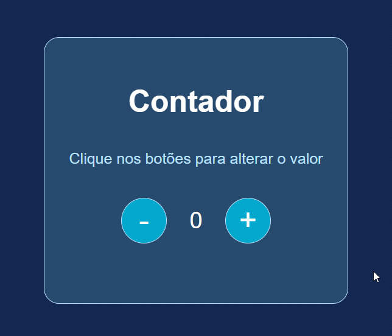

# Módulo: Introdução ao JavaScript  
## Aula prática: Criando um contador  

O conteúdo desta aula é baseado em um [repositório de Stephany Nusch](https://github.com/stebsnusch/basecamp-javascript/tree/main/introducao-ao-javascript/contador), disponibilizado pela [DIO](https://www.dio.me/) para o bootcamp Geração Tech Unimed-BH.

Esta foi a primeira aula prática de javascript.  
Foi apresentado o código para criação de um contador para incrementar e decrementar valores.  
Adicionalmente, eu pesquisei na internet e implementei como ocultar/exibir botões e como adicionar/remover alertas.  
  

