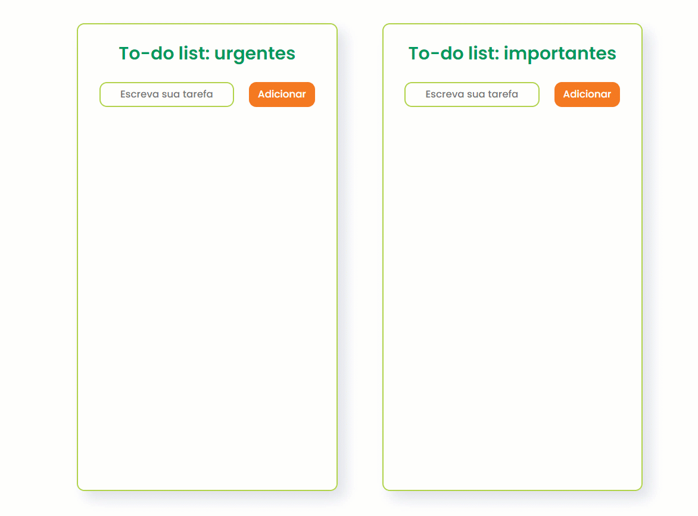

# Módulo: Introdução ao JavaScript  
## Aula prática: Criando um to-do list (lista de tarefas)  

O conteúdo desta aula é baseado em um [repositório de Stephany Nusch](https://github.com/stebsnusch/basecamp-javascript/tree/main/introducao-ao-javascript/to-do%20list), disponibilizado pela [DIO](https://www.dio.me/) para o bootcamp Geração Tech Unimed-BH.

## Desafio  

1) Criar um campo de *input* de texto e um botão para adicionar a tarefa à lista;  
2) Quando o botão for pressionado, o texto deve aparecer na lista com um *checkbox* ao lado;  
3) Ao selecionar o *checkbox*, o item correspondente deve ficar com o texto riscado (ex.: ~~tarefa completa~~).  
  
Além desses três pontos adicionei mais alguns recursos para melhorar a experiência do usuário:  
1) Divisão do projeto em duas listas: uma para itens urgentes e outra para itens importantes (mas não urgentes);  
2) Validação para impedir que o item seja inserido com texto em branco na lista. Fiz isso de duas maneiras diferentes, com propósito de estudo:  
  a) Direto no HTML, inserindo *required*, para a lista de itens urgentes;  
  b) Com javascript, após pesquisar na internet, alterando o *placeholder*, *borderColor* e *backgroundColor*, para a lista de itens importantes;  
3) Limitação no número de caracteres no *input*, usando *maxlength="20"*;  
4) Adição de responsividade para telas menores.  

#### Imagens  
Aspecto final:  
  
<!--    -->
  
Responsividade:  
  
<!--    -->
    
*maxlength="20"* para controle no *input*:  
  
<!--    -->
  
Dois tipos de validação, como descrito no texto acima:  
  
<!--    -->

Gif mostrando a validação de entrada e o *hover* no botão:   
  